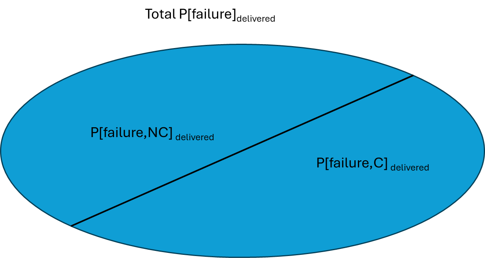

# IRR Equation


```{r test-rendering, echo=FALSE, results='asis'}
cat(info_box("This should be a styled into an info box"))
```

## Equation for the Total probability of Failure in delivered product

We start with the Law of Total Probability, which allows us to partition the Probability of Failure into two parts:

1. The Probability of Failure given Conformance - The probability of failure associated with product that conforms to requirements

2. The Probability of Failure given Nonconformance - the probability of failure associated with product that does not conform to requirements

We will label these as

1. $P_{total}[failure]_{delivered}$ the total probability of failure in the delivered airplane
2. $P[failure|C]_{delivered}$ the probability of failure given conformance in the delivered airplane
3. $P[failure|NC]_{delivered}$ the probability of failure given conformance in the delivered airplane

Note that it is key that all three terms are representing the same scale.  For example AC1309-1B measures the probability on a per hour basis.  THat would mean that we would also represent $P[failure|C]_{delivered}$ and $P[failure|NC]_{delivered}$ on a per hour basis.  


### Partitioning the Total Probability of Failure

In Figure 1 we use a Venn diagram to illustrate the partitioning of the probability of failure into two regions.

<br>

```{r, out.width="50%", echo = FALSE, fig.align="center", fig.cap = "Venn Diagram Partitioning the space for Total Probability of Failure in delvered product"}

```

The Venn Diagram shows two regions, the first is the joint probability that the prodcut fails and is nonconforming.  The second is the joint probability that the product fails and is conforming.

These are represented by

1. $P[fails,conforming]_{delivered}$
2. $P[fails,nonconforming]_{delivered}$

and the total probability of failure is defined as

$$
P_{total}[failure]_{delivered} = P[fails,conforming]_{delivered} + P[fails,nonconforming]_{delivered} \tag{1}
$$


Our next step is to expand the identified joint probabilities using the standard relationship

$$ Joint Probability = Marginal probability * Conditional Probability $$
In this case $P[fails,conforming]_{delivered}$ expands to 

$$ P[fails,conforming] = P[C]_{delivered} * P[failure|C]_{delivered} $$

Then $P[fails,conforming]_{delivered}$ expands to 

$$ P[fails,nonconforming] = P[NC]_{delivered} * P[failure|NC]_{delivered} $$

and now we can make substitutions in Equation X so that we arrive at a useful form in our discusison of the IRR

$$ P_{total}[failure]_{delivered} = P[C]_{delivered} * P[failure|C]_{delivered} + P[NC]_{delivered} * P[failure|NC]_{delivered} \tag{2}$$

## Linking the equation to a target maximum probability of failure 

In the design of product we are most interested in ensuring that $P_{total}[failure]_{delivered}$ does not exceed some threshold maximum probability of failure.  We will call this threshold maximum $P_{target}[failure]_{delivered}$.  Substituting this into our equation results in the following

$$ P_{target}[failure]_{delivered} >= P[failure|C]_{delivered}*P[C]_{delivered} + P[failure|NC]_{delivered}*P[NC]_{delivered} \tag{3}$$
In this form we are required to assess the four terms on the right hand side, making sure that the design decisions that are made do not result in values for these terms where the result will exceed $P_{target}[failure]_{delivered}$

## Rearrangment and the IRR definition

A useful relationship for this is to understand that our terms for ... are statistical complements

$$ P[NC]_{delivered} = 1 -P[C]_{delivered} $$

We are now ready to perform algebraic rearrangement of Equation X, which result in a form that supports our definition of the IRR.  When we are finished we arrive at

$$ P[C]_{delivered} >= \frac{P[failure|NC]_{delivered} - P_{target}[failure]_{delivered}}{P[failure|NC]_{delivered} -  P[failure|C]_{delivered}} \tag{4}$$
Finally, we define the IRR as $P[C]_{delivered}$

$$ IRR = P[C]_{delivered} \tag{5}$$

## Notes on PRobabilities

Each of the probabilities included are not restricted to point estimates.  They may be estimated by functions, which allows for IRR estimates where there is a range of nonconforming or conforming conditions to be evaluated.

### Functions for Conditional Probabilities of Failure

### Functions for marginal probabilities resulting from manufacturing

### Aggregating Individual IRR values to create product level IRR values

## Boundary Conditions

From Equation 4 we can derive three boundary conditions that must be satisfied.  

### Axioms of Probability

First we should understand that the five terms involved in Equation 4 are all probabilities.  This requires that we enforce the three axioms of probability:

1. nonnegativity
2. normalization
3. additivity

If these axioms are not satisified we will not be able to managed the reliability of the product by managing the outgoing quality of the manufacturing system.

### Lower Boundary

The lower boundary is set by considering that the First Axiom requires that a probability be nonnegative.  Each of these five probabilities cannot be less than 0.  We can evaluate the conditions where the IRR or $P[C]_{delivered}$ is set to 0.  OF course, in a simple relationship like this, we would expect 0 when the numerator of the ratio goes to 0:

$$P[failure|NC]_{delivered} - P_{target}[failure]_{delivered} = 0$$
This condition will exist when 

$$P[failure|NC]_{delivered} = P_{target}[failure]_{delivered}$$

If for any reason $P[failure|NC]_{delivered} < P_{target}[failure]_{delivered}$ the axiom of nonnegativity is violated and we will fail to produce a useful IRR value.  In other words if this boundary condition is violated we will not be able to managed the reliability of the product by managing the manufacturing system.

### Upper Boundary

The upper boundary is set by considering that the Second Axiom requires that a probability be >= 1.  Each of these five probabilities cannot be less than 0.  We can evaluate the conditions where the IRR or $P[C]_{delivered}$ is set to 1.  Of course, in a simple relationship like this, we would expect 1 when the numerator of the ratio is equal to the denominator:

$$P[failure|NC]_{delivered} - P_{target}[failure]_{delivered} = P[failure|NC]_{delivered} -  P[failure|NC]_{delivered}$$
This condition will exist when 

$$P[failure|C]_{delivered} = P_{target}[failure]_{delivered}$$

If for any reason $P[failure|C]_{delivered} > P_{target}[failure]_{delivered}$ the axiom of normalization is violated and we will fail to produce a useful IRR value.  In other words if this boundary condition is violated we will not be able to manage the reliability of the product by managing the manufacturing system.

### Mathematical Boundary

Our final boundary condition exists to protect the mathematical integrity of the equation.  This is really not derived from the axioms of probability, but from the need to avoid the limitation created when we divide by zero.  This occurs when the denominator of the ratio in Equation 4 goes to zero.  This in turn goes to the condition where 

$$P[failure|NC]_{delivered} - P[failure|NC]_{delivered} = 0$$

with the result that we cannot allow 

$$P[failure|NC]_{delivered} = P[failure|NC]_{delivered}$$

If for any reason $P[failure|NC]_{delivered} = P[failure|NC]_{delivered}$ the divide by 0 restriction is violated and we will fail to produce a useful IRR value.  In other words if this boundary condition is violated we will not be able to manage the reliability of the product by managing the manufacturing system.

## Summary