```{r setup, include=FALSE}
library(knitr)

# Set global chunk options
knitr::opts_chunk$set(echo = TRUE)

# Helper functions for cross-format compatibility
is_html_output <- function() {
  knitr::is_html_output()
}

is_latex_output <- function() {
  knitr::is_latex_output()
}

# Comment box functions that return character strings
info_box <- function(text, title = "Info") {
  if (is_html_output()) {
    paste0('<div class="info-box"><i class="fas fa-info-circle box-icon"></i><strong>', 
           title, ':</strong> ', text, '</div>')
  } else if (is_latex_output()) {
    paste0("\\begin{infobox}\n\\faInfoCircle\\ \\textbf{", title, ":} ", text, "\n\\end{infobox}")
  } else {
    paste0("**", title, ":** ", text)
  }
}

warning_box <- function(text, title = "Warning") {
  if (is_html_output()) {
    paste0('<div class="warning-box"><i class="fas fa-exclamation-triangle box-icon"></i><strong>', 
           title, ':</strong> ', text, '</div>')
  } else if (is_latex_output()) {
    paste0("\\begin{warningbox}\n\\faExclamationTriangle\\ \\textbf{", title, ":} ", text, "\n\\end{warningbox}")
  } else {
    paste0("**", title, ":** ", text)
  }
}

tip_box <- function(text, title = "Tip") {
  if (is_html_output()) {
    paste0('<div class="tip-box"><i class="fas fa-lightbulb box-icon"></i><strong>', 
           title, ':</strong> ', text, '</div>')
  } else if (is_latex_output()) {
    paste0("\\begin{tipbox}\n\\faLightbulb\\ \\textbf{", title, ":} ", text, "\n\\end{tipbox}")
  } else {
    paste0("**", title, ":** ", text)
  }
}

error_box <- function(text, title = "Error") {
  if (is_html_output()) {
    paste0('<div class="error-box"><i class="fas fa-times-circle box-icon"></i><strong>', 
           title, ':</strong> ', text, '</div>')
  } else if (is_latex_output()) {
    paste0("\\begin{errorbox}\n\\faTimesCircle\\ \\textbf{", title, ":} ", text, "\n\\end{errorbox}")
  } else {
    paste0("**", title, ":** ", text)
  }
}
```


# Introduction

The Initial Reliability Requirement (IRR) is integral to the application of AS9138. It provides a summary of the Design Engineer's evaluation of the effect of design decisions on the probability of failure in the delivered product.  This in turn becomes the target that must be achieved by the production system (combined effects of process capability and inspection system) to realize those results.

It is not easy to understand the IRR, how to develop one and how to apply it to the design and manufacture of product.  Fo many it is a completely new concept that is not a standard part of curent design practices.  

The problem then is to help the Design Engineer understand how design choices affect probability of failure, and how this affects the requirements passed on to manufacturing.  Then the Quality Engineer must understand and properly interpret the IRR to ensure that the delivered product will satisfy this requirement

The purpose of this tool then is to support exploring the relationships involved, learning the basics of how the IRR functions.  The tool can also be used to establish an IRR value for new designs and for existing designs that do not currently have an IRR value.

## The Book

But the most important aspect of the tool is the questions that the tool can help the Design Engineer and Quality Engineer can answer.  Each can benefit from the ability of the tool to relate real decision problems in Design and Quality 

### Chapter summaries

1. Chapter 1 Presents a general overview of the purpose of this app
2. Chapter 2 Discusses the relationship between reliability results and manufacturing outcomes
3. Chapter 3 Presents the IRR equation, the mathematical development, and the enforceable boundary conditions
4. Chapter 4 Discusses the IRR Calculator and offers several examples of applications
5. Chapter 5 Discusses the Design Space Analysis Tools and offers several examples of Applications
6. Chapter 6 Presents additional useful notes
7. Chapter 7 Provides a glossary for terms that may be less familiar to the users
8. Chapter 8 adds a list of relevant references used in the development of the Tutorial


### Using The Tool

To help a user understand how the app works including how the calculator works and how contour plots work.  This purpose is primarily about function.  These include questions like:

1. What inputs are required?
2. What boundary conditions are enforced by the tool
3. How to use the different tabs for the calculator and the design space analysis
4. How to use the graphical toolbar included with the contour plots in the design space analysis?

### The Design Engineering Tasks

The Design Engineer will ask how the IRR relates to design decisions that affect the two parameters Probability of Failure given Conformance and the Probability of Failure Given Nonconformance. More importantly, how do these choices affect the inspection system requirements that must be applied to the manufacturing system.

The Design Engineer has two primary tasks for which this tool will prove beneficial:

1. The design process - making design decisions that affect the Probability of Failure when conforming (closely related to margins of safety) and decisions that affect the Probability of Failure when nonconforming (closely related to fault tolerant design)
2. Evaluating possible IRR values for and existing product - many existing products were not designed with the IRR in mind.  But the design engineer may be asked to assign an IRR.  This process will require at a minimum a qualitative, heuristics driven process to assess original goal for the maximum allowable probability of failure required by the delivered product.  they will also need to assign estimates to the probability of failure given conformance and probability of failure given nonconformance and then the IRR that results from these three inputs.  Of course a process like this has risk for cognitive bias and is subject to significant epistemic uncertainty

### The Quality Engineering Tasks

The Quality Engineering Task is two fold.  First, the quality Engineer designs the Inspection System which in conjunction with the manufacturing processes will manage the realized probability of conformance in delivered product (the outgoing quality).  

Second, the Quality Engineer may be required to evaluate a proposed IRR (such as those provided in Appendix A of AS9138) for a given application.  To make that assessment, the Quality Engineer will be helped by understanding the three relevant questions the Quality Engineer must be prepared to answer:

1. What order of magnitude is associated with the target maximum probability of failure that the Design Engineer associates with the selected characteristic.
2. what is the relationship between the probability of failure given conformance for the existing design and the proposed IRR values selected?
3. what is the relationship between the probability of failure given nonconformance for the existing design and the proposed IRR values selected?
4. what is the relationship between the probability of failure given conformance and the probability of failure given nonconformance


## General Notes on the Tool

This section provides details regarding the Interface for this book, the layout of the App, and the graphs used to create visuals for the tool.

### Notes on the bookdown Interface

This Tutorial is presented using the bookdown interface [@R-bookdown].  There are several features of the bookdown interface used to display the book that are useful to understand.  We present an overview here:

The main interface is shown in Figure \@ref(fig:mainBook).  There a few simple controls that may prove useful to the user.

```{r mainBook, out.width="80%", echo = FALSE, fig.align="center", fig.cap = "Main bookdown Interface"}
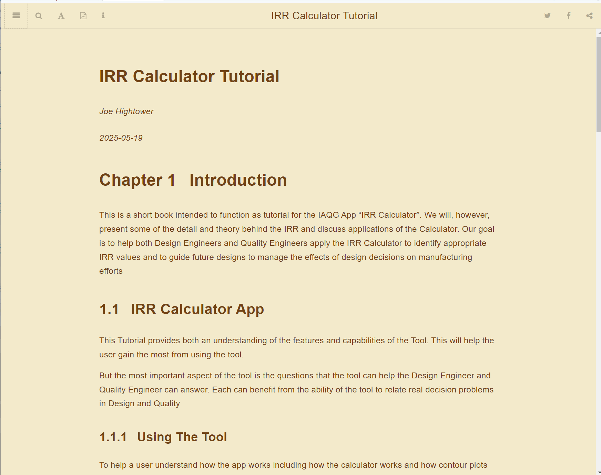
```

The Table of Contents can be made visible or hidden depending on preference Figure \@ref(fig:toc):

```{r toc, out.width="80%", echo = FALSE, fig.align="center", fig.cap = "The Table of Contents Sidebar"}
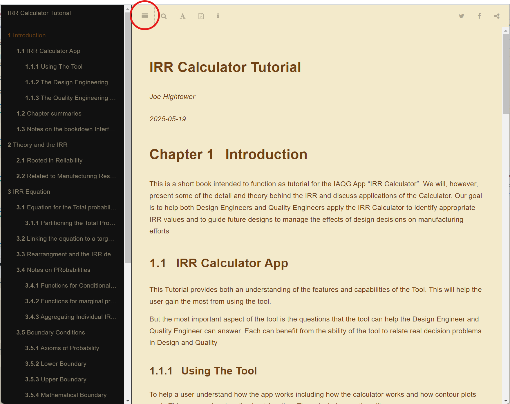
```

The book can be searched using this magnifying glass icon; see Figure \@ref(fig:search).  Text is entered at the top of the Table of Contents Bar:

```{r search, out.width="80%", echo = FALSE, fig.align="center", fig.cap = "Search Function"}
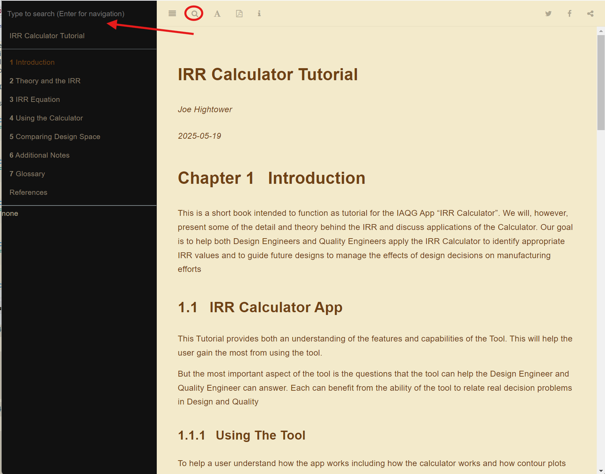
```

The App provides a few tools to manage font size, background color, line spacing, and font type; see Figure \@ref(fig:font):

```{r font, out.width="80%", echo = FALSE, fig.align="center", fig.cap = "Font Management"}
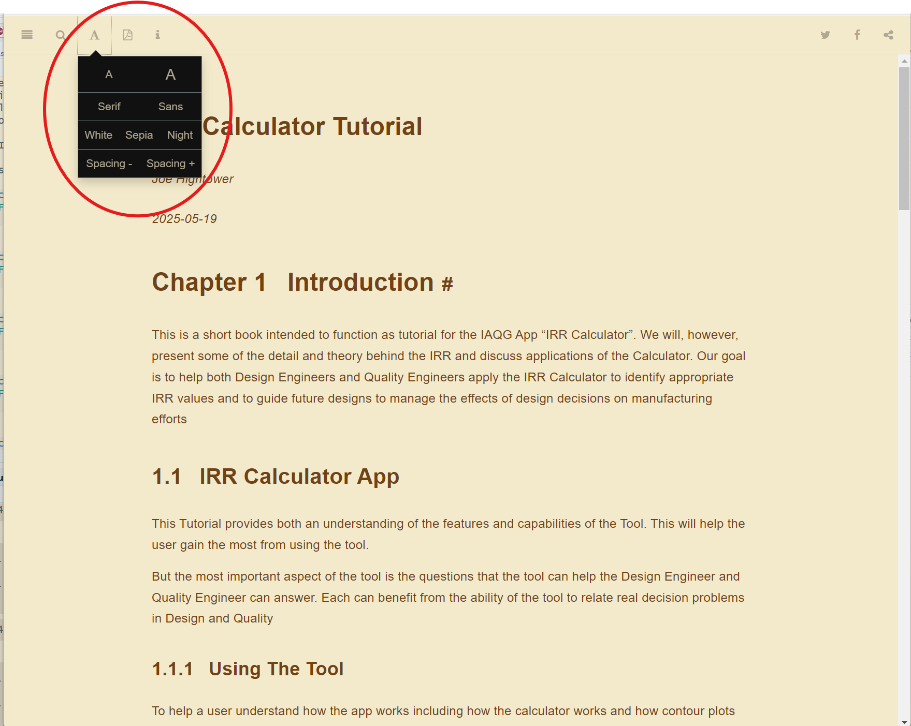
```

Shown in Figure \@ref(fig:download) this selection will allow the user to download a pdf copy of this book:

```{r download, out.width="80%", echo = FALSE, fig.align="center", fig.cap = "Download Selection"}
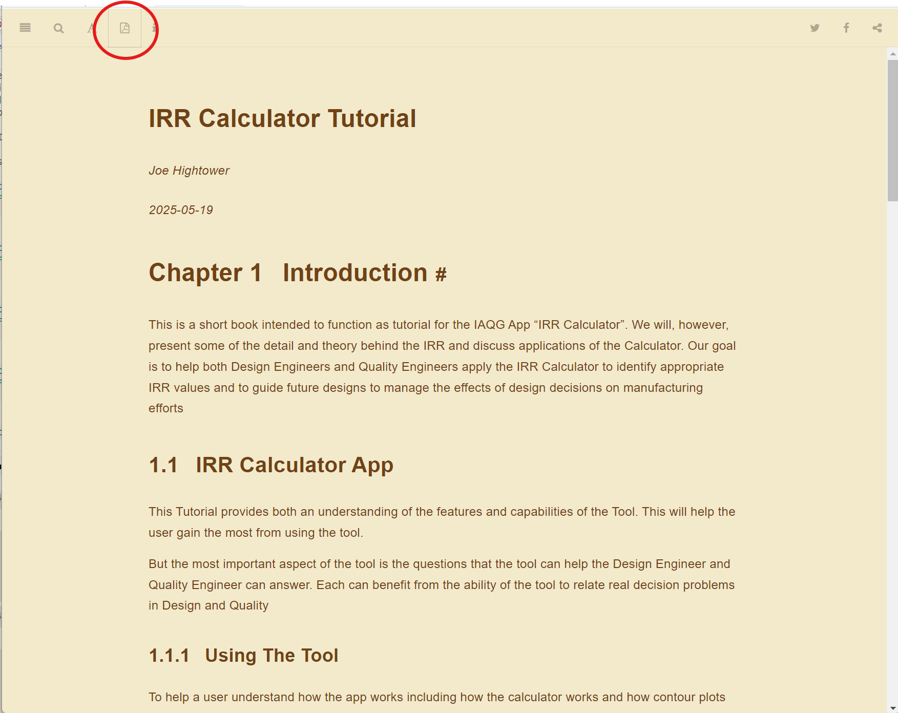
```

Finally in Figure \@ref(fig:sharing), in the upper right corner, the user can share pages from the book if desired:

```{r sharing, out.width="80%", echo = FALSE, fig.align="center", fig.cap = "Sharing"}
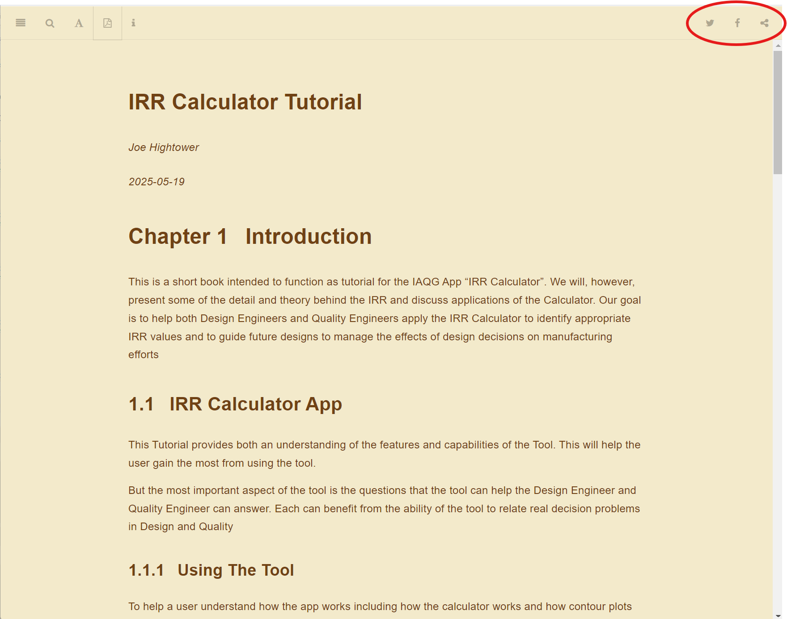
```

Beyond this there is a scrollbar on the right side of the page for scrolling through pages.  At the bottom of each page is a set of arrows that allow the user to turn to the next page.

### Notes on App Layout

This tool uses Shiny [@R-Shiny], an interface to provide functionality making data and data activities accessible in an accessible user interface.  Underneath the hood is R [@R-base], Which performs the statistical work behind the results the user interacts with.  

The Shiny Interface includes the following:

1.  Figure \@ref(fig:landing) show a the landing page where the App starts out

```{r landing, out.width="80%", echo = FALSE, fig.align="center", fig.cap = "Sharing"}
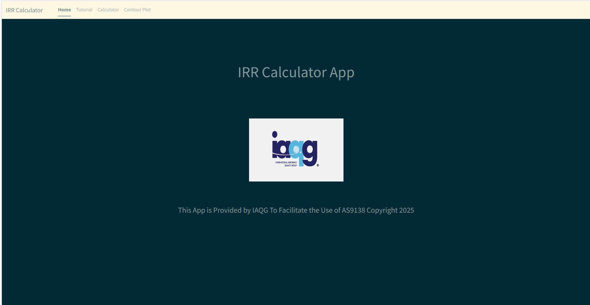
```

2.  From the Landing Page the user can use tabbed sections to access
a. Selecting the "Tutorial" tab as shown in Figure \@ref(fig:book) displays this tutorial

```{r book, out.width="80%", echo = FALSE, fig.align="center", fig.cap = "Main bookdown Interface"}

```

b. Selecting "Calculator" tab, shown in Figure \@ref(fig:calculator)

```{r calculator, out.width="80%", echo = FALSE, fig.align="center", fig.cap = "Calculator Tab"}
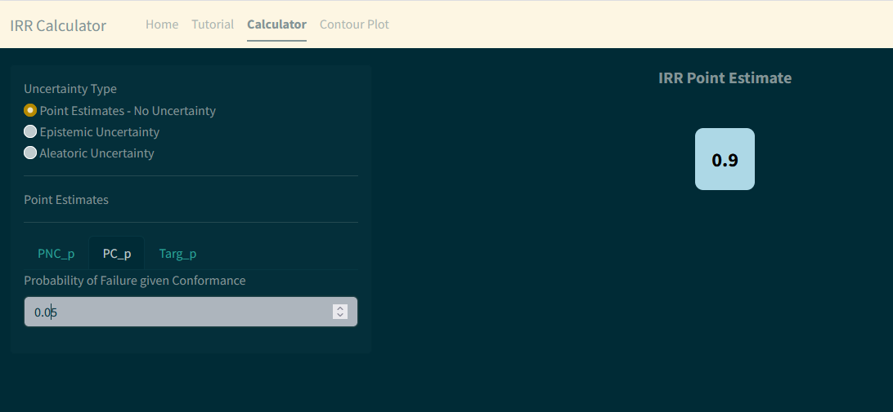
```

c. The Design Space Explorer

```{r contour, out.width="80%", echo = FALSE, fig.align="center", fig.cap = "Contour Tab"}
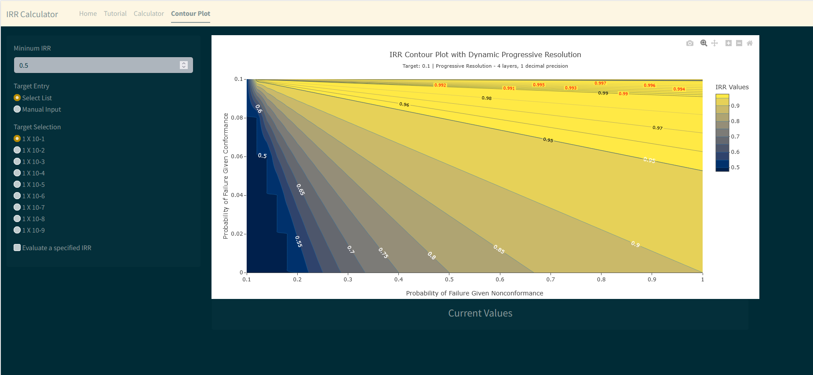
```
3.  Note that the application is designed to input required parameters on the left side and display results in the main area, see Figure \@ref(fig:layout)

```{r layout, out.width="80%", echo = FALSE, fig.align="center", fig.cap = "Application Layout}
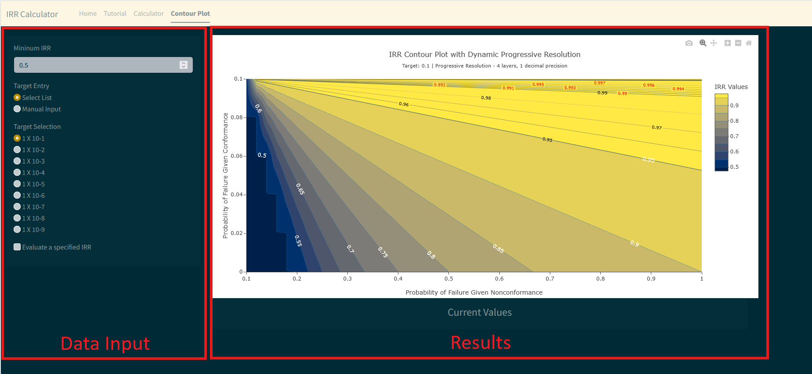
```
```{r, echo=FALSE, results='asis'}
cat(tip_box("The Data Input may include additonal tabs separating the three input values where each may require multiple inputs and other settings."))
```

### Notes on Plots Created in The IRR App

This tool uses Plotly R Open Source Graphing Library [@plotly], a graphing library library making publication quality graphs.  A key aspect of Plotly graphs is interactivity, through both the cursor and through a toolbar associated with each graph. 

Cursor interactivity changes depending on the graph type, but typically will include coordinate information of points where the cursor is located allowing the user to examine the data behind minimum and maximum values, etc. See Figure \@ref(fig:cursor) 

```{r cursor, out.width="80%", echo = FALSE, fig.align="center", fig.cap = "Cursor Highlights"}
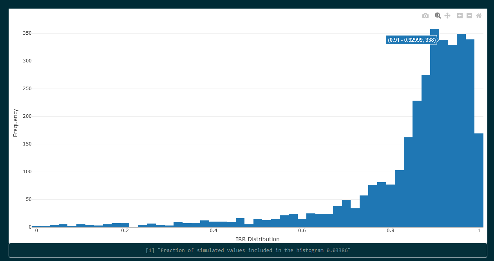
```

The Toolbar is located in the upper right of the plot area, see Figure \@ref(fig:plotly).  The Toolbar adds several useful tools including the ability to save a copy of the plot as a PNG image file, zoom, pan, and restore the plot to original scale.

```{r plotly, out.width="80%", echo = FALSE, fig.align="center", fig.cap = "Main bookdown Interface"}
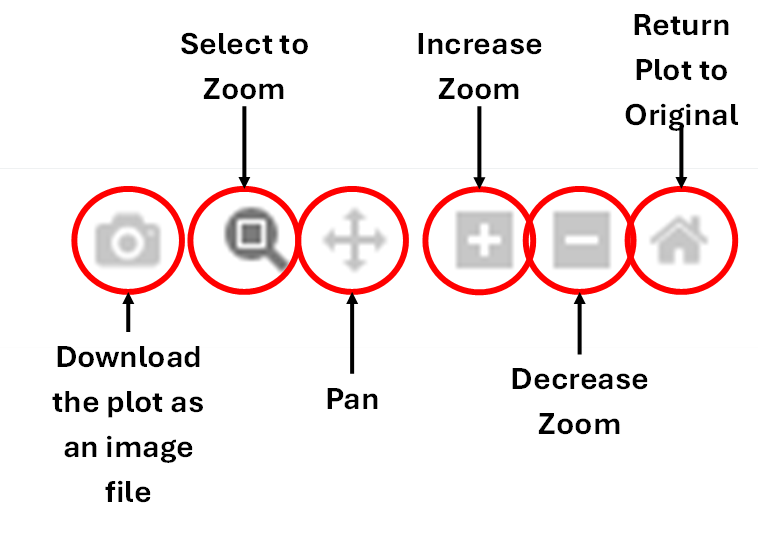
```

```{r, echo=FALSE, results='asis'}
cat(tip_box("The Download Image function captures the image as it appears on the screen.  If the image has been zoomed, panned, or returned to original scale, the captured image will reflect those choices."))
```
